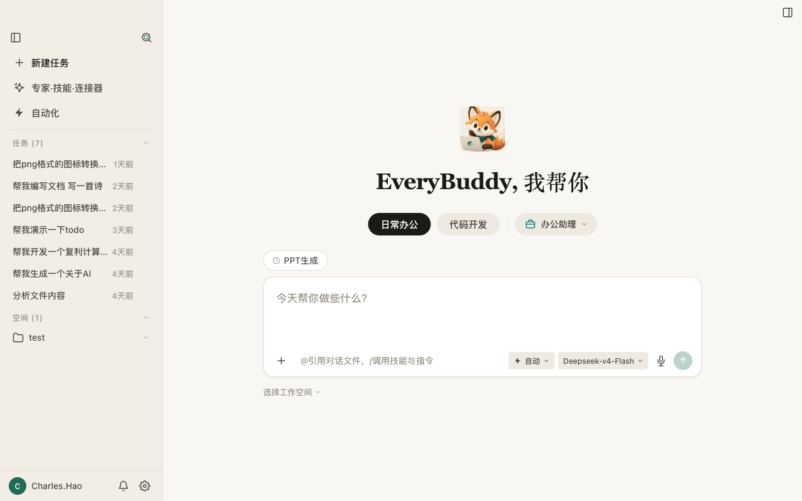
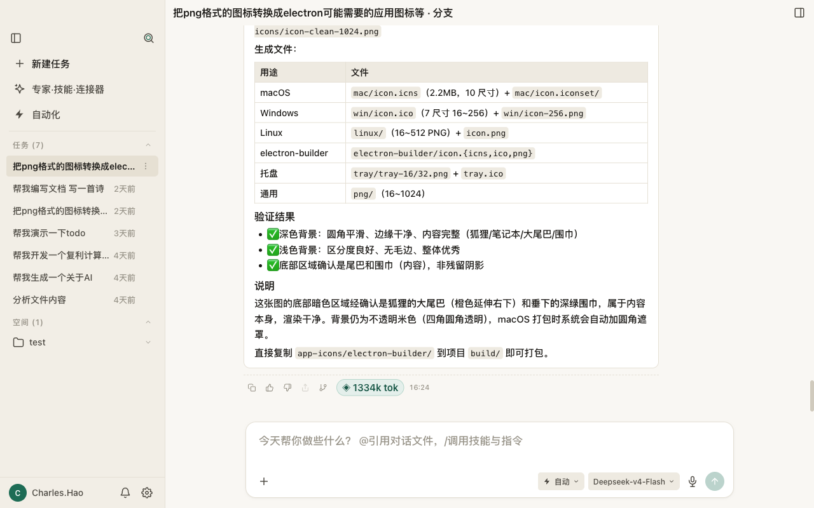
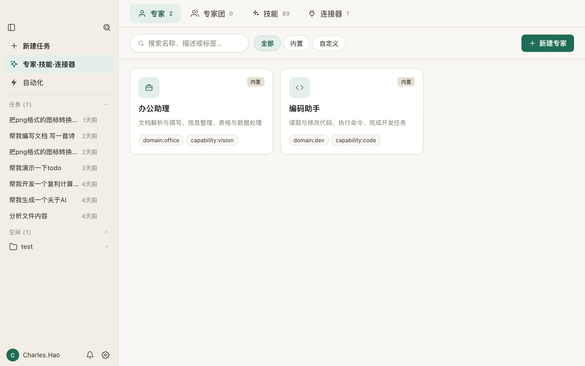
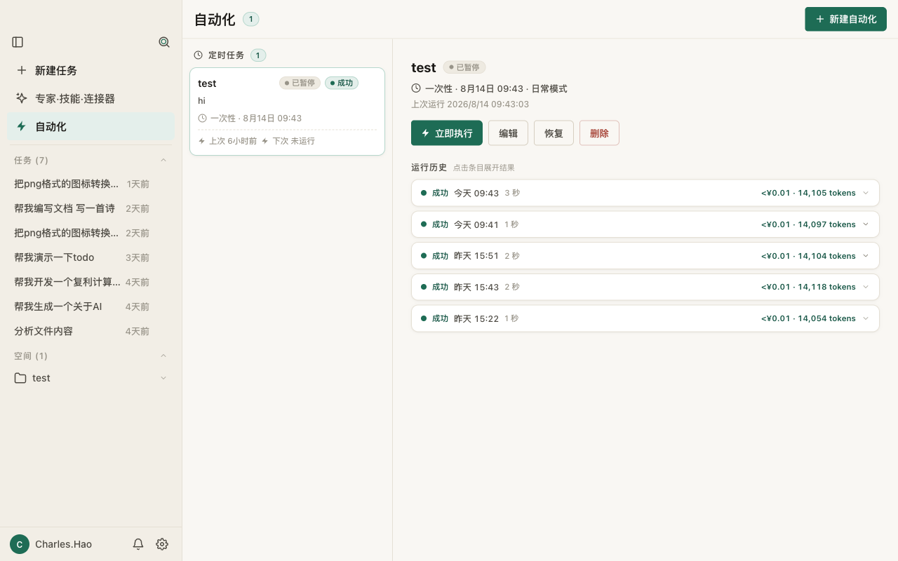

# EveryBuddy

**为每个人而生的个人桌面 Agent 助理。**

本地优先、开源的 **Codex / WorkBuddy 平替**。与一个能读你的代码、改你的文件、跑你的命令、看懂图片、生成图片、并按计划自动处理日常任务的 Agent 对话——一切都发生在你自己的机器上，用你自己的 API Key。

- [English](README.md) · [需求文档](docs/requirements.md) · [架构设计](docs/architecture.md) · [Agent SDK](docs/pi-coding-sdk.md)



---

## 亮点

- 🧑‍💼 **为每个人而生**——不止开发者。内置两位专家覆盖日常办公（文档、表格、规划）与代码开发（读、改、跑、探索），还可以创建你自己的。
- 🌐 **Codex / WorkBuddy 的开源平替**——本地优先、自托管，无订阅锁定。
- 🖼️ **真正的多模态**——语言模型 + **视觉工具**（理解、描述图片）+ **生图工具**，由 Agent 统一调度。
- 💰 **帮你节省成本**——自带 API Key 按量付费，无订阅；每条消息显示**真实 token / 费用**，并按 **LLM / VLM / 生图** 分型。
- ⏰ **自动化任务**——用 cron、预设或一次性方式定时执行 prompt；记录运行历史与费用；完成后系统通知。
- 🧑‍🔬 **专家 & 专家团**——可复用的人格，支持按能力分别指定模型（对话 / 视觉 / 生图），分组后一键切换。
- 🛠️ **技能管理**——安装、编写、启停 `SKILL.md` 技能包；拖入新目录自动发现。
- 🔌 **自定义连接器**——通过 **MCP**（stdio 或 Streamable HTTP）接入外部能力，可测试连接并绑定到专家。
- 🏢 **企业 / 个人定制化**——自定义专家、技能、连接器与标签体系，打造贴合自己工作方式的桌面 Agent。
- 🔒 **隐私安全**——Key 只存在系统钥匙串，渲染进程不可见；破坏性操作需二次确认；文件访问限制在工作区内。

---

## 为什么选择 EveryBuddy？

**它是你的 Agent，而不是厂商的。** EveryBuddy 运行在你的桌面，代码、会话、配置都留在本机。你自带模型 API Key，只用多少付多少——没有月费、没有云端数据流出、没有锁定。每次运行的费用，就明明白白显示在对话里。

| | EveryBuddy | Codex / WorkBuddy |
| --- | --- | --- |
| **模型成本** | 自带 API Key，按量付费 | 订阅制 |
| **数据位置** | 本地优先（`~/EveryBuddy`） | 厂商云端 |
| **开源** | ✅ | ❌ |
| **多模型** | 任意 OpenAI 兼容端点，LLM / VLM / Image 分型 | 厂商托管 |
| **可定制** | 专家、专家团、技能、MCP 连接器、标签 | 有限 |

---

## 功能

### 为每个人的个人 Agent

两位内置专家让你即刻上手——**办公助理**处理文档、表格与日常事务，**编码助手**负责读改代码、执行命令、探索项目。你还可以自定义专家：系统提示词、工具集、按能力分别指定模型（对话 / 视觉 / 生图）。

### 多模态：语言 + 视觉 + 生图

- **视觉**——Agent 调用 `understand_image` 描述或回答图片相关问题。当聊天模型不支持图片输入时，EveryBuddy 会自动把图片交给配置的 **VLM**，并把描述作为文本注入对话。
- **生图**——Agent 调用 `generate_image`，对接任意 OpenAI 兼容的 `/images/generations` 端点（如豆包 ARK、SiliconFlow、OpenAI），结果保存到工作区。

### 透明、省钱的计费

每条 AI 消息的 footer 都显示真实 token 数与费用（¥），并按 **LLM / VLM / Image** 分型汇总——分为**本条运行**与**会话累计**。动工之前先看清成本，也可以无痛切换到更便宜的模型。

### 定时自动化

自动化周期性或一次性 prompt：**预设**（每小时 / 每天 / 每周 / 每月）、**5 段 cron**、或**一次性**（"30 分钟后"）。每次运行流式产出结果，在运行历史中记录用量与费用，完成后可选发送系统通知。

### 专家 & 专家团

专家是可复用的 Agent 人格。把它们分组成**专家团**，一键切换不同工作组合。多 Agent 调度与 Workflow 编排已列入路线图，schema 已预留、零迁移。

### 技能管理

技能是 `SKILL.md` 格式的可复用指令包（用 `/名称` 调用）。浏览已安装技能、本地导入技能包、用内置编辑器自写、随时启停。拖入 `skills/` 的新目录会被自动发现。

### 自定义连接器（MCP）

通过**模型上下文协议（MCP）**接入外部能力——本地服务用 `stdio`（支持托管 `npm install` MCP server 包），远程端点用 **Streamable HTTP**，传输方式自动识别。测试连接即可列出其工具，再把连接器绑定到需要的专家。HTTP API / 数据源 / 自定义连接器类型已注册，预留到路线图。

### 隐私与安全

- API Key 通过系统原生对话框录入，存入系统钥匙串——**渲染进程永远读不到 Key**。
- 所有 IPC 均经 Zod 校验，主进程不信任任何来自 UI 的输入。
- 破坏性工具（`write` / `edit` / 删除 / `bash`）执行前需确认，支持按工作区白名单。
- 文件访问被沙箱限定在所选工作区内；`..` 与符号链接逃逸均被拦截。

---

## 截图







交互原型： [专家·技能·连接器](docs/demos/expert-skill-connector.html) · [自动化](docs/demos/automation.html) · [对话体验](docs/demos/dialog-experience.html)

---

## 快速开始

> **状态：** 早期开发中，积极迭代。需要 **Node.js 20+** 与 **npm 10+**。

```bash
npm install      # 安装依赖
npm run dev      # 启动桌面应用
```

然后在应用内：

1. 打开 **设置 → 模型设置**，添加至少一个 **LLM** 供应商（任意 OpenAI 兼容端点——如 OpenAI、DeepSeek、OpenRouter、豆包 ARK）。需要视觉再加 **VLM**，需要生图再加 **Image** 模型。
2. 选择或注册一个**工作空间**目录。
3. 说一句 *"EveryBuddy, 我帮你"*——选个专家，开始对话。

### 常用命令

| 命令 | 说明 |
| --- | --- |
| `npm install` | 安装依赖 |
| `npm run dev` | 启动桌面应用 |
| `npm run build` | 类型检查所有 workspace |
| `npm run test` | 单元测试 |
| `npm run test:e2e` | Electron E2E 测试 |
| `npm run lint` | Biome 检查 |
| `npm run make` | 打包桌面应用 |

---

## 文档

- [需求文档（PRD）](docs/requirements.md)
- [架构设计](docs/architecture.md)
- [Agent SDK 说明（pi-coding-agent）](docs/pi-coding-sdk.md)
- [协作指南](agents.md)

---

## 技术栈

| 分层 | 选型 |
| --- | --- |
| 桌面 | Electron · Electron Forge · Vite |
| UI | React 19 · TypeScript · Zustand · Tailwind CSS 4 |
| Agent 运行时 | [`@earendil-works/pi-coding-agent`](https://github.com/earendil-works/pi) |
| 多模态 | 视觉（VLM）+ OpenAI 兼容生图 |
| MCP | `@modelcontextprotocol/sdk`（stdio · Streamable HTTP） |
| 定时调度 | `cron-parser` |
| 校验 | Zod · TypeBox |
| 质量 | Vitest · Playwright · Biome |

## 仓库结构

```text
apps/
  desktop/            # Electron + React 桌面应用
packages/
  ipc-contract/       # 类型安全 IPC 契约 + Zod schema
  api-gateway/        # 统一请求路由层（预留给未来 IM / Web 客户端）
docs/                 # PRD、架构、计划、交互原型
scripts/
  capture-screenshots.mjs  # 重新生成 README 截图
```

---

## 路线图

- **专家团高级能力**——多 Agent 调度与 Workflow 编排（schema 已预留，零迁移）。
- **更多连接器类型**——HTTP API、数据源、文件系统的运行时注入。
- **企业级管控**——审计、合规、RBAC 明确延后（见[需求文档](docs/requirements.md)）。
- **Web / IM 客户端**——通过 API Gateway 复用同一套 Agent 运行时。

## License

MIT
